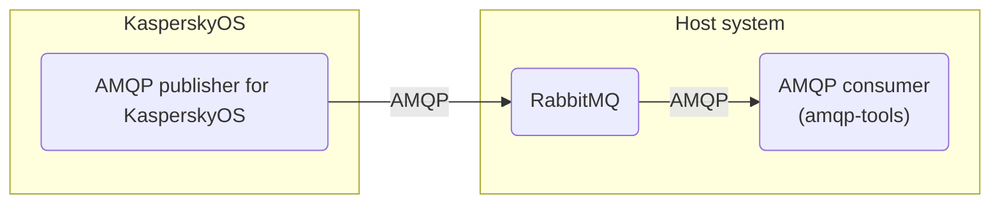

# AMQP publisher example

This solution demonstrates how to integrate the
[KasperskyOS-adapted version of RabbitMQ® C AMQP client library](../common/lib/README.md)
into a KasperskyOS-based solution.

To illustrate this integration, the solution provides a practical example: an AMQP (Advanced Message
Queuing Protocol) publisher that demonstrates asynchronous messaging capabilities using RabbitMQ as
the message broker. The publisher application sends messages from KasperskyOS to a consumer running
on the host system.

For additional details on KasperskyOS, including its limitations and known issues, please refer to
the [KasperskyOS Community Edition Online Help](https://kas.pr/si81).

## Table of contents
- [AMQP publisher example](#amqp-publisher-example)
  - [Table of contents](#table-of-contents)
  - [Solution overview](#solution-overview)
    - [List of programs](#list-of-programs)
    - [Solution scheme](#solution-scheme)
    - [Initialization description](#initialization-description)
    - [Security policy description](#security-policy-description)
  - [Getting started](#getting-started)
    - [Prerequisites](#prerequisites)
      - [QEMU](#qemu)
      - [Hardware](#hardware)
    - [Building and running the example](#building-and-running-the-example)
      - [QEMU](#qemu-1)
      - [Hardware](#hardware-1)
      - [CMake input files](#cmake-input-files)
  - [Usage](#usage)

## Solution overview

### List of programs

* `Publisher`—Program that is an implementation of the AMQP publisher.
* `DCM`—System program that lets you dynamically create IPC channels.
* `Ntpd`—System program that implements an NTP client that receives time parameters from external
  NTP servers in the background and forwards them to the KasperskyOS kernel.
* `BlobContainer`—System program required for working with dynamic libraries in shared memory.
* `EntropyEntity`—System program that implements random number generation.
* `DNetSrv`—Network card driver.
* `VfsSdCardFs`—System program that supports the file system of SD cards.
* `VfsNet`—System program that supports network protocols.
* `Dhcpcd`—System program that implements a DHCP client, which gets network interface parameters
  from an external DHCP server in the background and passes them to a virtual file system.
* `SDCard`—SD Card driver.

When you build the example for the target hardware platform, platform-specific drivers are
automatically included in the solution:

* `BSP`—Hardware platform support package (Board Support Package). Provides cross-platform
configuration of peripherals for the Radxa ROCK 3A and Raspberry Pi 4 B.
* `GPIO`—GPIO support driver for the Radxa ROCK 3A.
* `PinCtrl`—Low-level pin multiplexing (pinmux) configuration driver for the Radxa ROCK 3A.
* `Bcm2711MboxArmToVc`—Driver for working with the VideoCore (VC6) coprocessor via mailbox
technology for Raspberry Pi 4 B.

[⬆ Back to Top](#Table-of-contents)

### Solution scheme

This architecture features an AMQP publisher running in KasperskyOS that sends messages to a
RabbitMQ broker. The broker's deployment varies: it runs in a Docker container for QEMU environments
and directly on the host system for hardware configurations. Messages are consumed on the host
system using the `amqp-tools` utilities.



### Initialization description

The solution initialization description file named `init.yaml` is generated during the solution
build process based on the [`./einit/src/init.yaml.in`](einit/src/init.yaml.in) template. Macros in
the `@INIT_*@`‌ ‌format contained in the template are automatically expanded in the resulting
`init.yaml` file. For more details, refer to
[init.yaml.in template](https://kas.pr/nb5m).

### Security policy description

The [`./einit/src/security.psl`](einit/src/security.psl) file describes the security policy of the
solution. The declarations in the PSL file are provided with comments that explain the purpose of
these declarations. For more information about the `security.psl` file, see
[Describing a security policy for a KasperskyOS-based solution](https://kas.pr/jm1v).

[⬆ Back to Top](#Table-of-contents)

## Getting started

### Prerequisites

1. Confirm that your host system meets all the
[System requirements](https://kas.pr/u87d)
listed in the KasperskyOS Community Edition Developer's Guide.
1. [Install](https://kas.pr/ce73)
the KasperskyOS Community Edition SDK version 1.4. You can download it for free from
[os.kaspersky.com](https://kas.pr/4mro).
1. Copy the source files of this example to your local project directory.
1. Source the SDK setup script to configure the build environment. This exports the `KOSCEDIR`
  environment variable, which points to the SDK installation directory:
   ```sh
   source /opt/KasperskyOS-Community-Edition-<platform>-<version>/common/set_env.sh
   ```
1. [Build the necessary drivers](https://kas.pr/ia13)
from source only if you intend to run this example on Radxa ROCK 3A hardware. This step is not
required for QEMU or Raspberry Pi 4 B.

#### QEMU

1. Make sure that the Docker software is installed and running.
   ```
   $ systemctl status docker
   ```
1. To run the RabbitMQ message broker, run the
[RabbitMQ Docker official image](https://hub.docker.com/_/rabbitmq) using the following command:
   ```
   $ docker run -d -p 5672:5672 --hostname my-rabbit --name some-rabbit rabbitmq:3
   ```
1. Create an alias for your network interface with the address `10.0.2.2/24`:
   ```
   $ sudo ip a a 10.0.2.2/24 dev docker0
   ```
   >A static IP address `10.0.2.2` and port `5672` are set for RabbitMQ message broker using the
`AMQP_BROKER_ADDRESS` and `AMQP_BROKER_PORT` environment variables. You can change the broker
address and port in the file [`./einit/src/init.yaml.in`](einit/src/init.yaml.in) according to
your network configuration.
1. Install the package `amqp-tools` (command-line utilities for interacting with AMQP servers):
   ```
   $ sudo apt-get update -y
   $ sudo apt install amqp-tools
   ```
1. To check your environment, run the following command:
   ```
   $ docker stats
   ```
   The screen should display information about the `some-rabbit` running container.
1. To start the AMQP consumer on the host system when running the example on QEMU, run the
following command:
   ```
   $ amqp-consume --server=10.0.2.2 --port=5672 --exchange=amq.direct --routing-key=test cat
   ```

#### Hardware

1. To install required packages on your host system, run the following command:
   ```
   $ sudo apt install rabbitmq-server amqp-tools
   ```
1. Set your computer network interface to have a static IPv4 address `10.0.2.2/24`.
1. To make sure the RabbitMQ message broker is operating, run the following command:
   ```
   $ systemctl status rabbitmq-server.service
   ```
1. To start the AMQP consumer on the host system when running the example on Raspberry Pi 4 B or Radxa ROCK 3A, run the following command:
   ```
   $ amqp-consume --server=localhost --port=5672 --exchange=amq.direct --routing-key=test cat
   ```

By default in the RabbitMQ message broker the `guest` user is [prohibited](https://www.rabbitmq.com/access-control.html#loopback-users)
from connecting from remote hosts; it can only connect over a loopback interface (i.e. `localhost`).
This applies to connections regardless of the protocol. To get around this limitation, follow the
steps below:

1. Use `rabbitmqctl` to create a new user with the desired credentials:
   ```
   $ sudo rabbitmqctl add_user <user_name> <password>
   ```
1. Use the following command to set the virtual host access permissions for the new user:
   ```
   $ sudo rabbitmqctl set_permissions --vhost '/' <user_name> '.*' '.*' '.*'
   ```
   (The full permissions are for illustrative purposes only. In a real solution, grant permissions
carefully.)
1. Replace the `guest`/`guest` credentials with <`user_name`>/<`password`> in the [`publisher.cpp`](./publisher/src/publisher.cpp) file.

[⬆ Back to Top](#Table-of-contents)

### Building and running the example

The AMQP publisher for KasperskyOS is built using the CMake build system, which is provided in the
KasperskyOS Community Edition SDK. When you develop a KasperskyOS-based solution, use the
[recommended structure of project directories](https://kas.pr/9zph)
to simplify the use of CMake scripts.

#### QEMU

To build the example to run on QEMU, go to the directory with the example and run the following
commands:
```sh
$ cmake -B build \
        -D CMAKE_TOOLCHAIN_FILE="$KOSCEDIR/toolchain/share/toolchain-aarch64-kos.cmake"
$ cmake --build build --target {kos-qemu-image|sim}
```

where:

* `kos-qemu-image` creates a KasperskyOS-based solution image for QEMU that includes the example;
* `sim` creates a KasperskyOS-based solution image for QEMU that includes the example and runs it

After a successful build, the `kos-qemu-image` solution image will be located at the `./build/einit`
directory.

#### Hardware

To build the example to run on the target hardware platform, go to the directory with the example
and run the following commands:
```sh
$ cmake -B build \
        -D CMAKE_TOOLCHAIN_FILE="$KOSCEDIR/toolchain/share/toolchain-aarch64-kos.cmake"
$ cmake --build build --target {kos-image|sd-image}
```
where:

* `kos-image` creates a KasperskyOS-based solution image that includes the example;
* `sd-image` creates a file system image for a bootable SD card.

After a successful build, the `kos-image` solution image will be located at the `./build/einit`
directory. The `hdd.img` bootable SD card image will be located at the `./build` directory.

To run the example on the target hardware platform:

1. Connect the SD card to the computer.
1. Copy the bootable SD card image to the SD card using the command:
   ```sh
   $ sudo dd bs=64k if=build/hdd.img of=/dev/sd[X] conv=fsync
   ```
   where `[X]` is the final character in the name of the SD card block device.

1. Connect the bootable SD card to the board.
1. Supply power to the board and wait for the example to run.

You can also use an alternative option to prepare and run the example:

1. Prepare the required hardware platform and bootable SD card by following the instructions in the
KasperskyOS Community Edition Online Help:
    * [Raspberry Pi 4 B](https://kas.pr/i8mg)
    * [Radxa ROCK 3A](https://kas.pr/21n7)
1. Run the example by following the instructions in the
[KasperskyOS Community Edition Online Help](https://kas.pr/9oa7)

#### CMake input files

[./publisher/CMakeLists.txt](publisher/CMakeLists.txt)—CMake commands for building the `Publisher`
program.

[./einit/CMakeLists.txt](einit/CMakeLists.txt)—CMake commands for building the `Einit` program and
the solution image.

[./CMakeLists.txt](CMakeLists.txt)—CMake commands for building the solution.

## Usage

After [building and running](#building-and-running-the-example) the example, follow these steps:

1. Wait until a message similar to the following appears in the QEMU standard output:
   ```
   [Publisher] {"sequence"=1}
   ...
   [Publisher] {"sequence"=100}
   ```
1. A message similar to the following should appear in the host operating system standard output:
   ```
   Server provided queue name: amq.gen-66CuP6WkyGbSerDewSCSow
   {"sequence"=1}...{"sequence"=100}
   ```

[⬆ Back to Top](#Table-of-contents)

© 2026 AO Kaspersky Lab
